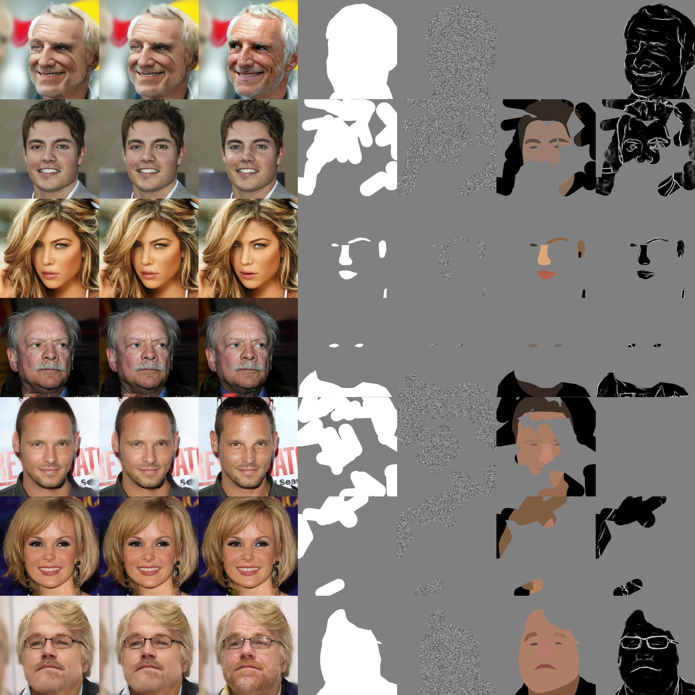
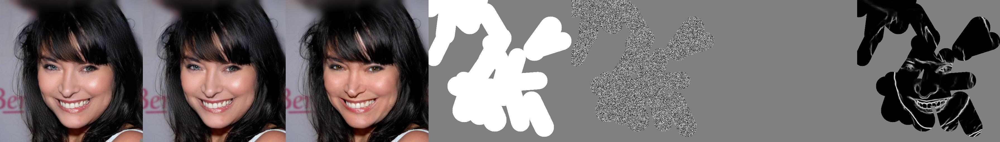
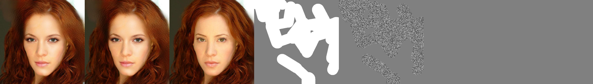

# SC_FEGAN_pytorch
This repository is an unofficial implementation of [SC-FEGAN](https://github.com/run-youngjoo/SC-FEGAN) by pytorch which published in ICCV 2019. 

## Requirements
* python3.7+
* pytorch 1.7.0+
* others.

## Usage
training a model
```bash
python3 main.py --config config.yml
```

testing a model
```bash
Not implmented yet
```

## Results

### Train Images


### Test Images





## License
Attribution-NonCommercial-ShareAlike 4.0 International

## Reference
1. [SE-FEGAN](https://github.com/run-youngjoo/SC-FEGAN)
2. [DeepFillv2](https://github.com/zhaoyuzhi/deepfillv2)
3. [Spectral Normalization](https://github.com/christiancosgrove/pytorch-spectral-normalization-gan/blob/master/spectral_normalization.py)
4. [Dataset](https://github.com/switchablenorms/CelebAMask-HQ)

## To do
- [ ] upgrade training code
- [ ] upgrade color domain image and training

## Color Data by super pixel
